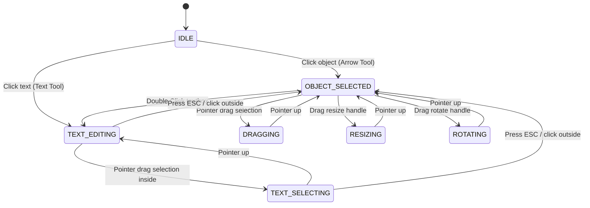

# Editing State Machine Diagram

This state machine details how active interaction states transition in the ToolWala Native PDF Engine:

```mermaid
stateDiagram-v2
    [*] --> IDLE
    
    IDLE --> OBJECT_SELECTED : Click object (Arrow Tool)
    IDLE --> TEXT_EDITING : Click text (Text Tool)
    
    OBJECT_SELECTED --> DRAGGING : Pointer drag selection
    OBJECT_SELECTED --> RESIZING : Drag resize handle
    OBJECT_SELECTED --> ROTATING : Drag rotate handle
    OBJECT_SELECTED --> TEXT_EDITING : Double Click textbox
    
    DRAGGING --> OBJECT_SELECTED : Pointer up
    RESIZING --> OBJECT_SELECTED : Pointer up
    ROTATING --> OBJECT_SELECTED : Pointer up
    
    TEXT_EDITING --> TEXT_SELECTING : Pointer drag selection inside
    TEXT_SELECTING --> TEXT_EDITING : Pointer up
    
    TEXT_EDITING --> OBJECT_SELECTED : Press ESC / click outside
    TEXT_SELECTING --> OBJECT_SELECTED : Press ESC / click outside
```
