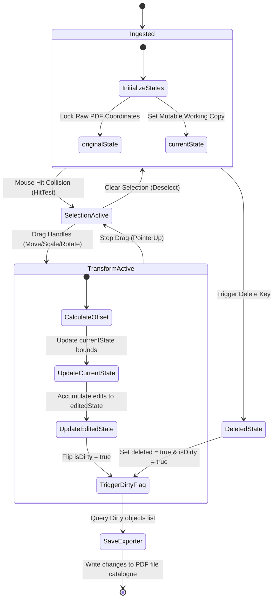

# Object Lifecycle Diagram

This state diagram records the lifecycle phases of PDF objects inside the ToolWala registries, tracking transaction states and dirty commits.

```mermaid
stateDiagram-v2
    [*] --> Ingested
    
    state Ingested {
        [*] --> InitializeStates
        InitializeStates --> originalState : Lock Raw PDF Coordinates
        InitializeStates --> currentState : Set Mutable Working Copy
    }
    
    Ingested --> SelectionActive : Mouse Hit Collision (HitTest)
    SelectionActive --> TransformActive : Drag Handles (Move/Scale/Rotate)
    
    state TransformActive {
        [*] --> CalculateOffset
        CalculateOffset --> UpdateCurrentState : Update currentState bounds
        UpdateCurrentState --> UpdateEditedState : Accumulate edits to editedState
        UpdateEditedState --> TriggerDirtyFlag : Flip isDirty = true
    }
    
    TransformActive --> SelectionActive : Stop Drag (PointerUp)
    SelectionActive --> Ingested : Clear Selection (Deselect)
    
    Ingested --> DeletedState : Trigger Delete Key
    DeletedState --> TriggerDirtyFlag : Set deleted = true & isDirty = true
    
    TriggerDirtyFlag --> SaveExporter : Query Dirty objects list
    SaveExporter --> [*] : Write changes to PDF file catalogue
```
