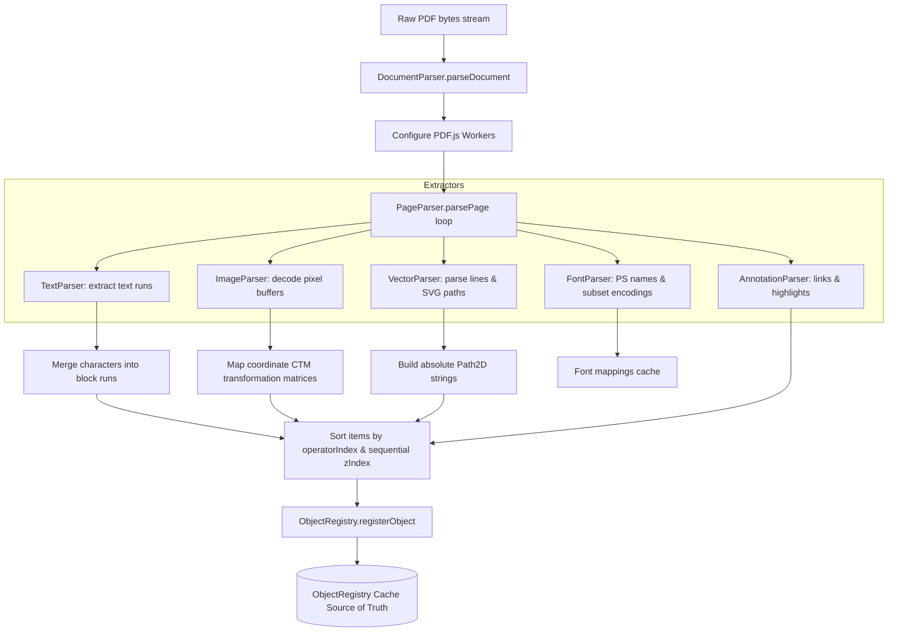

# Parser Flow Diagram

This flowchart outlines the raw PDF ingestion pipeline, parsing page operators and fonts metadata, and loading items into the singleton registry cache.

```mermaid
graph TD
    pdfBytes[Raw PDF bytes stream] --> docParser[DocumentParser.parseDocument]
    docParser --> workerSetup[Configure PDF.js Workers]
    workerSetup --> pageLoader[PageParser.parsePage loop]
    
    subgraph Extractors
        pageLoader --> textParser[TextParser: extract text runs]
        pageLoader --> imgParser[ImageParser: decode pixel buffers]
        pageLoader --> vecParser[VectorParser: parse lines & SVG paths]
        pageLoader --> annotParser[AnnotationParser: links & highlights]
        pageLoader --> fontParser[FontParser: PS names & subset encodings]
    end
    
    textParser --> mergeRuns[Merge characters into block runs]
    imgParser --> trackingCTM[Map coordinate CTM transformation matrices]
    vecParser --> compileSVG[Build absolute Path2D strings]
    
    mergeRuns --> sortZIndex[Sort items by operatorIndex & sequential zIndex]
    trackingCTM --> sortZIndex
    compileSVG --> sortZIndex
    annotParser --> sortZIndex
    
    sortZIndex --> registerObj[ObjectRegistry.registerObject]
    fontParser --> registerFont[Font mappings cache]
    
    registerObj --> registry[(ObjectRegistry Cache Source of Truth)]
```
