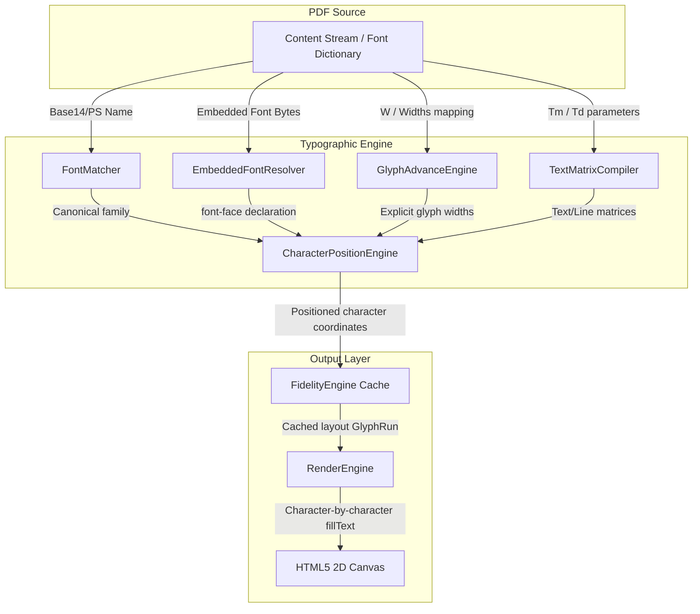

# Text Fidelity Flow Diagram

This flow diagram illustrates the data conversion pipeline from raw PDF Content Streams to Canvas Output in the Text Fidelity Engine:

```mermaid
graph TD
    subgraph PDF Source
        contentStream[Content Stream / Font Dictionary]
    end

    subgraph Typographic Engine
        matcher[FontMatcher]
        resolver[EmbeddedFontResolver]
        advances[GlyphAdvanceEngine]
        compiler[TextMatrixCompiler]
        posEngine[CharacterPositionEngine]
    end

    subgraph Output Layer
        runCache[FidelityEngine Cache]
        render[RenderEngine]
        canvas[HTML5 2D Canvas]
    end

    contentStream -->|Base14/PS Name| matcher
    contentStream -->|Embedded Font Bytes| resolver
    contentStream -->|W / Widths mapping| advances
    contentStream -->|Tm / Td parameters| compiler

    matcher -->|Canonical family| posEngine
    resolver -->|font-face declaration| posEngine
    advances -->|Explicit glyph widths| posEngine
    compiler -->|Text/Line matrices| posEngine

    posEngine -->|Positioned character coordinates| runCache
    runCache -->|Cached layout GlyphRun| render
    render -->|Character-by-character fillText| canvas
```
