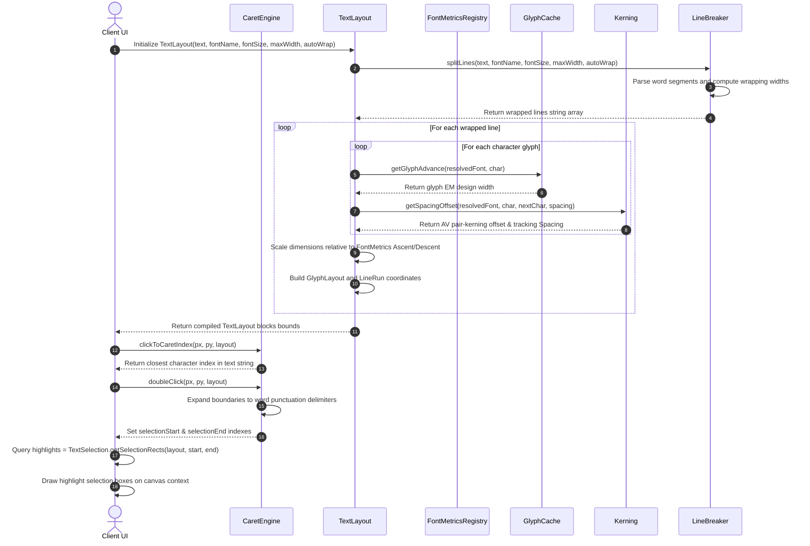

# Text Ingestion & Typesetting Layout Sequence Diagram

This sequence diagram outlines typesetting layouts compiles, caret coordinates mapping, and selections highlight boxes calculations.

```mermaid
sequenceDiagram
    autonumber
    actor User as Client UI
    participant C as CaretEngine
    participant TL as TextLayout
    participant FM as FontMetricsRegistry
    participant GC as GlyphCache
    participant K as Kerning
    participant LB as LineBreaker

    User->>TL: Initialize TextLayout(text, fontName, fontSize, maxWidth, autoWrap)
    TL->>LB: splitLines(text, fontName, fontSize, maxWidth, autoWrap)
    LB->>LB: Parse word segments and compute wrapping widths
    LB-->>TL: Return wrapped lines string array
    
    loop For each wrapped line
        loop For each character glyph
            TL->>GC: getGlyphAdvance(resolvedFont, char)
            GC-->>TL: Return glyph EM design width
            TL->>K: getSpacingOffset(resolvedFont, char, nextChar, spacing)
            K-->>TL: Return AV pair-kerning offset & tracking Spacing
        end
        TL->>TL: Scale dimensions relative to FontMetrics Ascent/Descent
        TL->>TL: Build GlyphLayout and LineRun coordinates
    end
    TL-->>User: Return compiled TextLayout blocks bounds
    
    User->>C: clickToCaretIndex(px, py, layout)
    C-->>User: Return closest character index in text string
    
    User->>C: doubleClick(px, py, layout)
    C->>C: Expand boundaries to word punctuation delimiters
    C-->>User: Set selectionStart & selectionEnd indexes
    
    User->>User: Query highlights = TextSelection.getSelectionRects(layout, start, end)
    User->>User: Draw highlight selection boxes on canvas context
```
